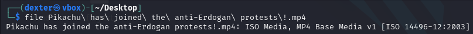
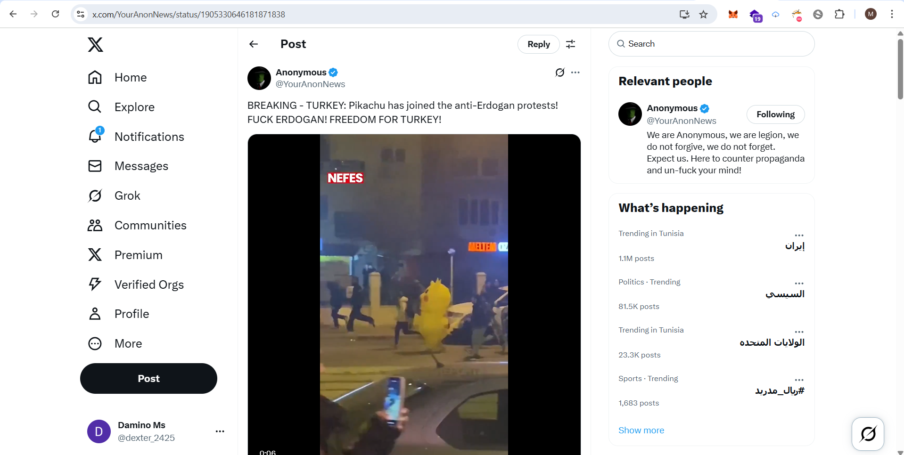
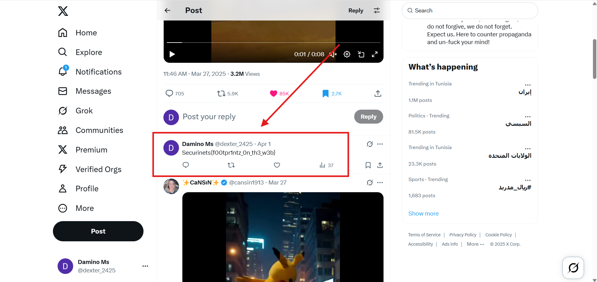

# **CTF Writeup: Pikachu (OSINT Challenge)**

## **Challenge Solution**

### **1. Video Identification**

The challenge provided a video file:

```bash
file "Pikachu has joined the anti-Erdogan protests!.mp4"
```

**Output:**

```
ISO Media, MP4 Base Media v1 [ISO 14496-12:2003]
```



### **2. Twitter Investigation**

Located the original tweet containing this video:

- **Account:** @YourAnonNews
- **Tweet URL:** https://x.com/YourAnonNews/status/1905330646181871838
- **Content:** "BREAKING - TURKEY: Pikachu has joined the anti-Erdogan protests!"



### **3. Flag Discovery**

After examining the tweet's comments, found the flag posted by the challenge organizers:

```
Securinets{f00tpr1ntz_0n_th3_w3b}
```



## **Key Steps**

1. Verified video file properties
2. Searched Twitter for distinctive video title
3. Located original @YourAnonNews post
4. Reviewed all comments for flag

## **Final Answer**

**Flag:**

```
Securinets{f00tpr1ntz_0n_th3_w3b}
```

**Source Tweet:**  
https://x.com/YourAnonNews/status/1905330646181871838

**Time to Solve:** ~15 minutes
