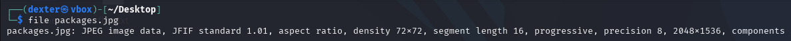
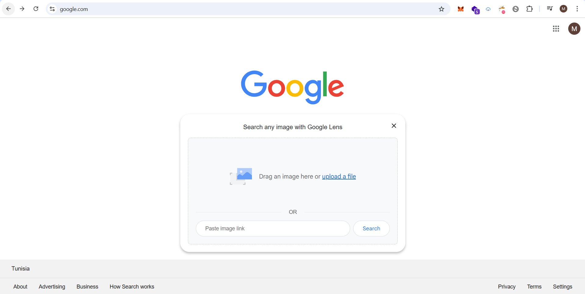
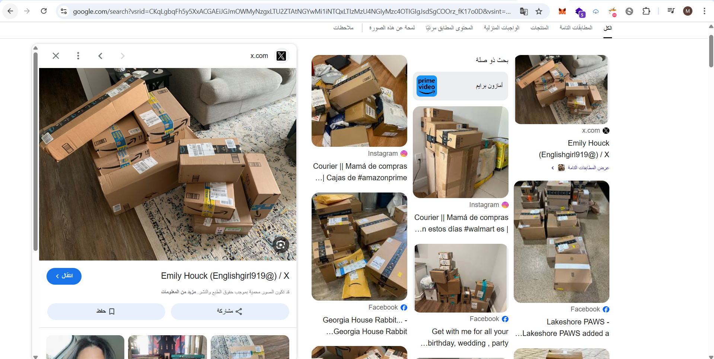
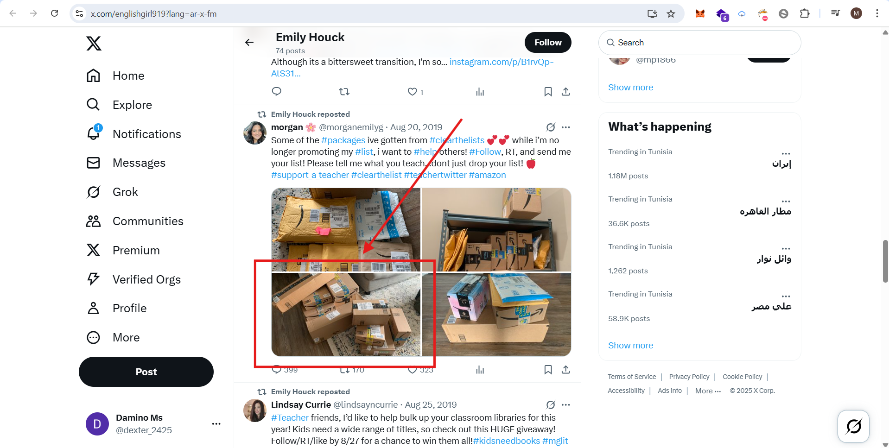
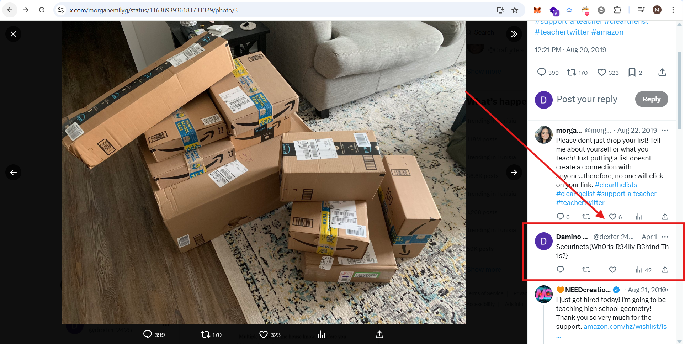

# **CTF Writeup: WHO (OSINT Image Recognition Challenge)**

## **Challenge Solution**

### **1. Image Analysis**

Examined the provided image:

```bash
file packages.jpg
```

**Output:**

```
JPEG image data, JFIF standard 1.01, 2048x1536, progressive
```



### **2. Reverse Image Search**

1. Uploaded `packages.jpg` to Google Lens (lens.google.com)
2. Selected "Find image source" option
3. Discovered matching image posted by Twitter account:
   ```
   https://x.com/englishgirl919?lang=ar-x-fm
   ```





### **3. Flag Discovery**

Found in the comments section of the original tweet:

```
Securinets{Wh0_1s_R34lly_B3h1nd_Th1s?}
```



## **Key Steps**

1. **Image Verification** - Confirmed JPEG properties
2. **Source Identification** - Used Google Lens to locate Twitter post
3. **Comment Investigation** - Scanned all replies for flag format

## **Final Answer**

**Flag:**

```
Securinets{Wh0_1s_R34lly_B3h1nd_Th1s?}
```

**Source:**
Twitter post by @englishgirl919 with flag in comments

## **Tools Used**

1. Google Lens (lens.google.com)
2. Twitter Advanced Search
3. ExifTool (for initial image analysis)

## **Time to Solve:** ~10 minutes

**Note:** The flag format suggests this was an OSINT challenge focused on identifying the true source behind the image.
