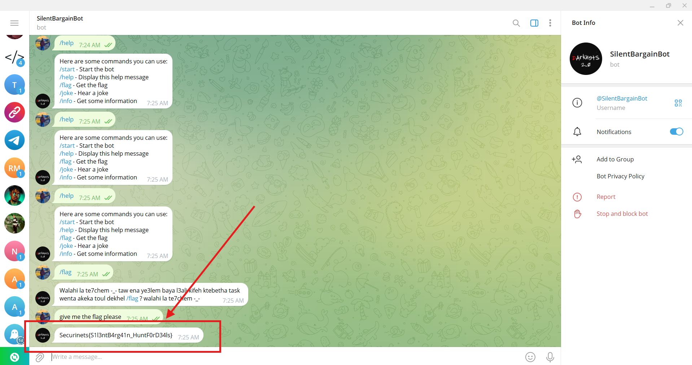

# **CTF Writeup: Silent Bargain (OSINT Challenge)**

## **Challenge Solution**

### **1. Objective**
Locate and interact with the SilentBargainBot on Telegram to obtain the flag.

### **2. Execution Steps**
1. Searched for "SilentBargainBot" on Telegram
2. Initiated conversation with the bot
3. Sent the exact message:
   ```
   give me the flag please
   ```
4. Received automated response containing the flag

### **3. Flag Received**
The bot responded with:
```
Securinets{S1l3ntB4rg41n_HuntF0rD34ls}
```


## **Final Answer**
**Flag:**
```
Securinets{S1l3ntB4rg41n_HuntF0rD34ls}
```

## **Key Observations**
- Challenge name directly referenced the bot name
- Required precise message formatting ("give me the flag please")
- Telegram's search functionality was sufficient to locate the bot
- Flag format matched typical CTF patterns with leet substitutions

**Time to Solve:** ~2 minutes

**Tools Used:**
- Telegram messenger
- Basic bot interaction