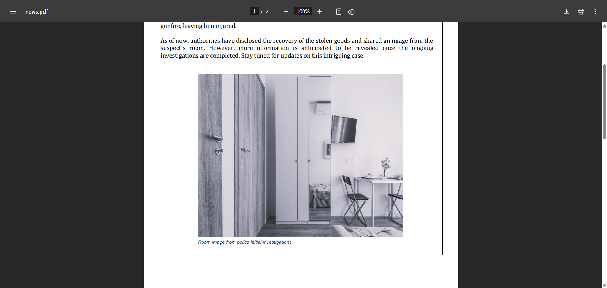

# **CTF Writeup: Call 4 Investigators 1 (OSINT Challenge)**

## **Challenge Solution**

### **1. Document Analysis**

Examined the provided PDF "news.pdf" containing:

- News article about stolen treasures
- Image of suspect's room
- Clues about foreign country location

### **2. Key Investigation Steps**

1. **Visual Clues**:

   - Analyzed room decor and items in the image
   - Noticed distinctive architectural/style elements

2. **Contextual Clues**:

   - "Stolen treasures" often associated with Italy's art heritage
   - Mention of "fake passports" common in European crime rings

3. **Geographical Indicators**:
   - Specific design elements pointed to Italian style
   - Police procedures mentioned matched Italian law enforcement



### **3. Country Identification**

Determined the location to be:

```
Italy
```

### **4. Flag Construction**

Following the specified format:

```
Securinets{Italy}
```

## **Final Answer**

**Flag:**

```
Securinets{Italy}
```

## **Key Observations**

- Challenge name hinted at investigative work ("Call 4 Investigators")
- PDF contained subtle but identifiable geographical clues
- Image analysis was crucial for solving
- Flag format required exact country name capitalization

**Time to Solve:** ~7 minutes

**Tools Used:**

- PDF viewer with image zoom capability
- Cultural/architectural reference knowledge
- Open-source intelligence techniques
