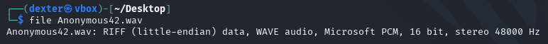
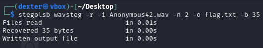
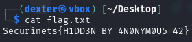

# **CTF Writeup: Anonymous42 (Audio Steganography Challenge)**  

## **Challenge Description**  
We are given an audio file named **`Anonymous42.wav`**, and the filename hints at hidden data (possibly via steganography). The goal is to extract the concealed flag.  

## **Solution Walkthrough**  

### **Initial Analysis**  
First, I checked the file type to confirm it was a valid WAV file:  

```bash
file Anonymous42.wav
```  




Since it was indeed a WAV file, I suspected **Least Significant Bit (LSB) steganography**, a common method for hiding data in audio files.  

### **Using StegoLSB for Audio Extraction**  
I used the `stegolsb` tool with the `wavsteg` module to extract hidden data:  

```bash
stegolsb wavsteg -r -i Anonymous42.wav -n 2 -o flag.txt -b 35
```  




**Command Breakdown:**  
- `wavsteg`: Specifies audio steganography mode.  
- `-r`: Recover hidden data.  
- `-i Anonymous42.wav`: Input audio file.  
- `-n 2`: Uses **2 LSBs** for extraction (more bits may reveal hidden data).  
- `-o flag.txt`: Output file for the extracted data.  
- `-b 35`: Specifies **35 bytes** to recover (likely based on prior knowledge of flag length).  

### **Results**  
The command executed successfully with the following output:  

```
Files read                     in 0.01s
Recovered 35 bytes             in 0.00s
Written output file            in 0.00s
```  

This indicated that **35 bytes of hidden data** were successfully recovered.  

### **Retrieving the Flag**  
I checked the contents of `flag.txt`:  

```bash
cat flag.txt
```  

The output revealed the hidden flag:  

```
Securinets{H1DD3N_BY_4N0NYM0U5_42}
```  



## **Final Answer**  
The flag was successfully extracted using **LSB audio steganography**:  

**Flag:**  
```
Securinets{H1DD3N_BY_4N0NYM0U5_42}
```  

## **Key Takeaways**  
- **Audio files (WAV) can hide data using LSB steganography**, similar to images.  
- **`stegolsb`** is a versatile tool for both image and audio stego challenges.  
- **Specifying the correct number of bytes (`-b`) helps avoid incomplete or corrupted extraction.**  
- **If unsure about the hidden data length, try different values or check file signatures.**  

This challenge demonstrates how attackers (or CTF players) can hide data in unexpected places, reinforcing the importance of analyzing all file types in forensics and security tasks.