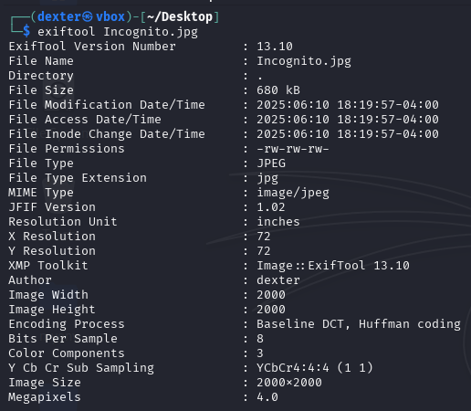
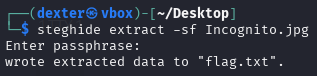
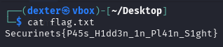

# **CTF Writeup: Incognito (Steganography Challenge)**

## **Challenge Overview**

**Task:** Extract hidden data from the provided image file `Incognito.jpg`.

### **Initial Analysis**

First, I examined the file using `exiftool` to check for any metadata clues:

```bash
┌──(dexter㉿vbox)-[~/Desktop]
└─$ exiftool Incognito.jpg
```



**Key Observations:**

- The image is a JPEG file (`2000x2000` pixels, `4.0 Megapixels`).
- The **Author** field contains `dexter`, which could be significant.
- No other obvious clues in the metadata.

### **Steganography Approach**

Since metadata alone didn't reveal the flag, I suspected **steganography** was used to hide data.

#### **1. Attempting File Extraction with Steghide**

I used `steghide`, a common steganography tool, to check for embedded files:

```bash
┌──(dexter㉿vbox)-[~/Desktop]
└─$ steghide extract -sf Incognito.jpg
```



- **First Attempt:** Tried an empty passphrase (just pressing Enter) → **Failed**.
- **Second Attempt:** Used `dexter` (from the Author metadata) as the passphrase → **Success!**

```bash
Enter passphrase: dexter
wrote extracted data to "flag.txt".
```

#### **2. Retrieving the Flag**

After successful extraction, I checked the contents of `flag.txt`:

```bash
┌──(dexter㉿vbox)-[~/Desktop]
└─$ cat flag.txt
```



### **Final Flag**

The hidden flag was successfully extracted:  
**`Securinets{P45s_H1dd3n_1n_Pl41n_S1ght}`**

## **Lessons Learned**

- **Metadata Hints:** Always check metadata fields like `Author`, `Comment`, or `Description` for possible passphrases.
- **Steghide Usage:** If an empty passphrase fails, try known keywords from the file’s properties.
- **Alternative Tools:** If `steghide` doesn’t work, tools like `binwalk`, `stegsolve`, or `foremost` could be used.

---

**Tags:** #Steganography #CTF #Forensics #Steghide #ExifTool #Metadata
