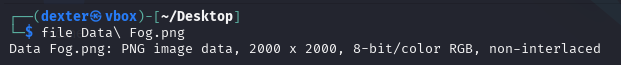
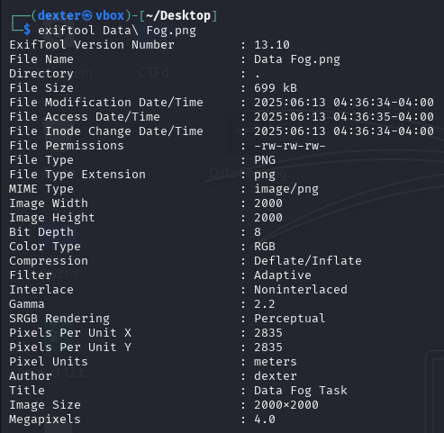
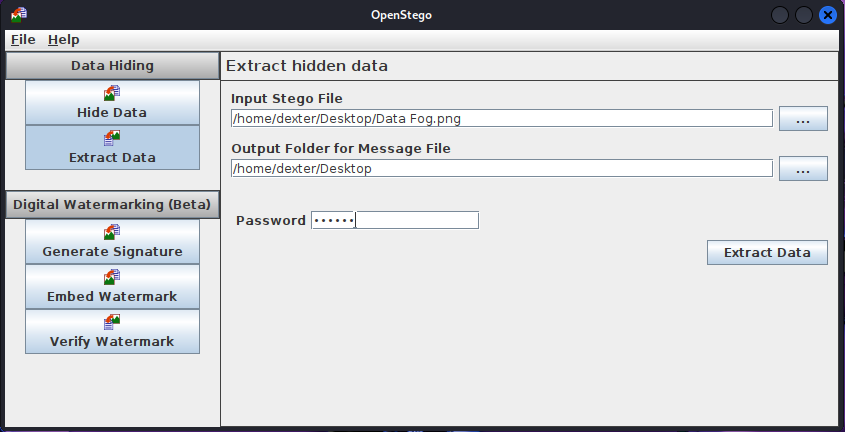
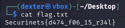

# **CTF Writeup: Data Fog (Steganography Challenge)**

## **Challenge Overview**

The challenge provided a PNG image named **`Data Fog.png`** (2000×2000 pixels). The name _"Data Fog"_ suggested obscured or hidden data, likely protected by steganography.

### **Initial Observations**

- **File Type**: Standard PNG (RGB, non-interlaced)
- **Size**: 2000×2000 pixels (ample space for hidden data)
- **Metadata**: Contained an **Author** field (`dexter`), which turned out to be critical.

---

## **Step-by-Step Solution**

### **1. File Inspection**

First, I confirmed the file type:

```bash
file "Data Fog.png"
```

**Output**:

```
Data Fog.png: PNG image data, 2000 x 2000, 8-bit/color RGB, non-interlaced
```



### **2. Metadata Analysis**

Using `exiftool`, I checked for hidden clues:

```bash
exiftool "Data Fog.png"
```

**Key Findings**:

- **Author**: `dexter`
- **Title**: `Data Fog Task`
- No other suspicious fields.



### **3. Extracting Hidden Data**

Since the challenge hinted at a **metadata-based password**, I used **OpenStego (GUI)** to extract the concealed file:

1. **Selected "Extract Data"**
2. **Loaded `Data Fog.png`**
3. **Entered password**: `dexter` (from the `Author` field)
4. **Extracted the hidden flag** into `flag.txt`.  
   

### **4. Retrieving the Flag**

I viewed the extracted flag using:

```bash
cat flag.txt
```

**Output**:

```
Securinets{d474_f06_15_r34l}
```

## 

## **Key Takeaways**

✅ **Metadata is a goldmine** – Simple fields like `Author` or `Comment` often contain passwords.  
✅ **Password-protected steganography** – Tools like OpenStego, `steghide`, or `stegolsb` may require credentials.  
✅ **Challenge names hint at methods** – _"Data Fog"_ implied obscured data, suggesting steganography.

---

## **Final Answer**

**Flag**:

```
Securinets{d474_f06_15_r34l}
```

This challenge reinforced how attackers can hide data in plain sight, even in seemingly normal images. Always inspect metadata and try multiple stego tools! 🔍
