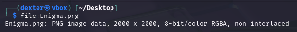
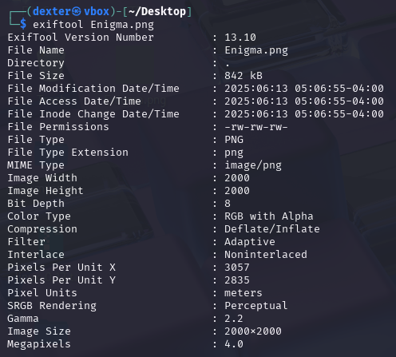
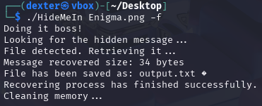
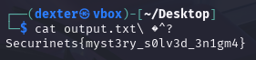

# **CTF Writeup: Enigma (Steganography Challenge)**

## **Challenge Overview**

The challenge presented a PNG image named "Enigma.png" (2000×2000 pixels). The name "Enigma" suggested a hidden message requiring specialized tools to decode.

## **Solution Walkthrough**

### **1. Initial File Analysis**

First, I verified the file type:

```bash
file Enigma.png
```

**Output:**

```
Enigma.png: PNG image data, 2000 x 2000, 8-bit/color RGBA, non-interlaced
```



### **2. Metadata Examination**

I checked for hidden clues in the metadata:

```bash
exiftool Enigma.png
```

**Findings:**

- Standard PNG metadata
- No obvious clues in EXIF data
- RGBA format suggested potential alpha channel manipulation



### **3. Using HideMeIn Tool**

I downloaded the specialized steganography tool HideMeIn from:

```
https://github.com/danielcardeenas/AudioStego/blob/master/BuildRelease/HideMeIn?raw=true
```

Then executed it against the image:

```bash
./HideMeIn Enigma.png -f
```

**Tool Output:**

```
Doing it boss!
Looking for the hidden message...
File detected. Retrieving it...
Message recovered size: 34 bytes
File has been saved as: output.txt
Recovering process has finished successfully.
Cleaning memory...
```



### **4. Retrieving the Flag**

The extracted message was saved in output.txt:

```bash
cat output.txt
```

**Flag Found:**

```
Securinets{myst3ry_s0lv3d_3n1gm4}
```



## **Technical Analysis**

- **HideMeIn Tool**: Specialized in extracting hidden data from PNG files
- **RGBA Format**: Alpha channel may have been used for data hiding
- **No Password Needed**: Unlike previous challenges, this didn't require credentials

## **Key Takeaways**

1. **Specialized Tools Matter**: Some stego challenges require specific tools
2. **Alpha Channel Potential**: RGBA images offer additional hiding space
3. **Challenge Names Are Clues**: "Enigma" hinted at needing a special decoder

## **Final Answer**

**Flag:**

```
Securinets{myst3ry_s0lv3d_3n1gm4}
```

## **Lessons Learned**

- Always research challenge names for tool hints
- Multiple stego techniques may be needed
- GitHub often hosts specialized CTF tools

Note: The HideMeIn tool can be downloaded from:

```
https://github.com/danielcardeenas/AudioStego/blob/master/BuildRelease/HideMeIn?raw=true
```
