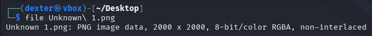
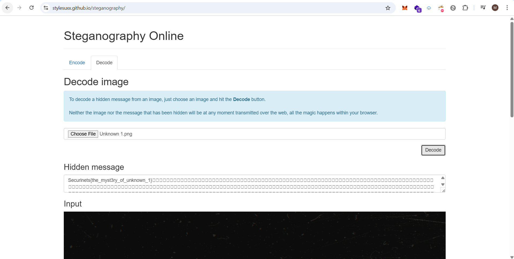
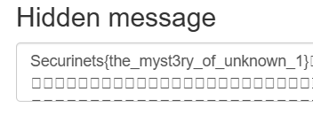

# **CTF Writeup: Unknown 1 (Steganography Challenge)**

## **Challenge Solution**

### **1. Image Analysis**

The challenge provided a PNG image:

```bash
file Unknown\ 1.png
```

**Output:**

```
Unknown 1.png: PNG image data, 2000 x 2000, 8-bit/color RGBA, non-interlaced
```



### **2. Web-Based Extraction**

Using the online steganography decoder:

1. Navigated to: https://stylesuxx.github.io/steganography/
2. Uploaded "Unknown 1.png"
3. Clicked "Decode" button
4. The tool automatically extracted the hidden flag



### **3. Flag Revealed**

The website displayed the hidden message:

```
Securinets{the_myst3ry_of_unknown_1}
```



## **Key Points**

- RGBA format provided extra data hiding capacity
- Web tool handled the extraction effortlessly
- No password or advanced tools required

## **Final Flag**

```
Securinets{the_myst3ry_of_unknown_1}
```

**Tool Used:**  
https://stylesuxx.github.io/steganography/
