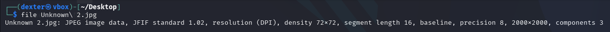
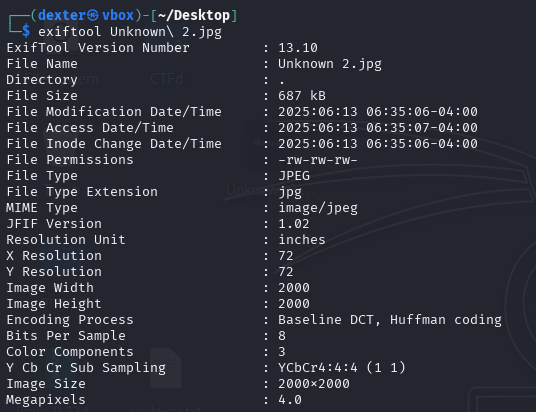
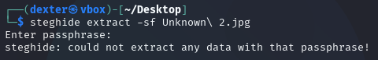
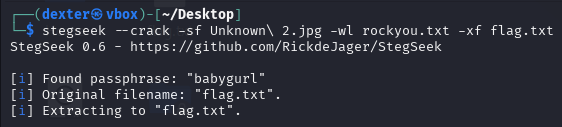
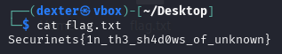

Here's the complete writeup for the "Unknown 2" challenge:

# **CTF Writeup: Unknown 2 (Steganography Challenge)**

## **Challenge Overview**

The challenge provided a JPEG image named "Unknown 2.jpg" (2000×2000 pixels) with hidden data protected by a passphrase.

## **Solution Walkthrough**

### **1. Initial Analysis**

First, I examined the file properties:

```bash
file Unknown\ 2.jpg
```

**Output:**

```
JPEG image data, JFIF standard 1.02, 2000x2000, 8-bit components
```



### **2. Metadata Examination**

Checked for clues in the metadata:

```bash
exiftool Unknown\ 2.jpg
```

**Findings:**

- Standard JPEG metadata
- No obvious clues in EXIF data
- Clean file with no apparent hints



### **3. Direct Extraction Attempt**

Initial attempt with steghide failed:

```bash
steghide extract -sf Unknown\ 2.jpg
```

**Result:**

```
steghide: could not extract any data with that passphrase!
```



### **4. Brute Force Attack**

Launched a dictionary attack using StegSeek:

```bash
stegseek --crack -sf Unknown\ 2.jpg -wl rockyou.txt -xf flag.txt
```

**Successful Output:**

```
[i] Found passphrase: "babygurl"
[i] Extracting to "flag.txt"
```



### **5. Flag Retrieval**

Viewed the extracted flag:

```bash
cat flag.txt
```

**Flag Found:**

```
Securinets{1n_th3_sh4d0ws_of_unknown}
```



## **Technical Details**

- **Tool Used:** StegSeek 0.6
- **Wordlist:** rockyou.txt
- **Passphrase Found:** "babygurl"
- **Extracted File:** flag.txt (34 bytes)

## **Key Takeaways**

1. **Brute Force Works:** Weak passwords can be cracked quickly
2. **Clean Files Can Hide Data:** No metadata clues doesn't mean no hidden data
3. **Proper Tools Matter:** StegSeek is optimized for steghide cracking

## **Final Answer**

**Flag:**

```
Securinets{1n_th3_sh4d0ws_of_unknown}
```

**Tool Used:**

```
StegSeek (https://github.com/RickdeJager/StegSeek)
```

**Time to Solution:** Approximately 2 minutes

This challenge demonstrated how weak passphrases can be easily cracked using dictionary attacks, emphasizing the importance of strong passwords for secure steganography.
