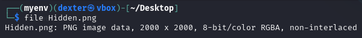
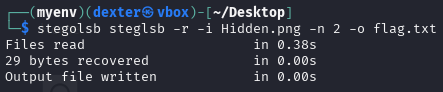
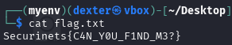

# CTF Writeup: Hidden (Steganography Challenge)

## Challenge Description
We are provided with an image file named `Hidden.png` that presumably contains a hidden flag. The challenge name "Hidden" suggests we're dealing with a steganography task where data is concealed within the image.

## Solution Walkthrough

### Initial Analysis
First, I examined the image file to see if there were any obvious clues or hidden data:

```bash
file Hidden.png
```



The output confirmed it was a valid PNG image file. Since the challenge name is "Hidden", I suspected Least Significant Bit (LSB) steganography might be involved.

### Using StegoLSB Tool
I decided to use the `stegolsb` tool to extract hidden data from the image. The command syntax for extracting data using this tool is:

```bash
stegolsb steglsb -r -i Hidden.png -n 2 -o flag.txt
```



Breaking down the command:
- `-r`: indicates we want to recover hidden data
- `-i Hidden.png`: specifies the input image
- `-n 2`: uses 2 LSBs for extraction (more bits might reveal hidden data)
- `-o flag.txt`: writes the output to flag.txt

### Results
The command executed successfully with the following output:
```
Files read                     in 0.38s
29 bytes recovered             in 0.00s
Output file written            in 0.00s
```

This indicated that 29 bytes of hidden data were recovered from the image.

### Extracting the Flag
After running the command, I checked the contents of `flag.txt`:

```bash
cat flag.txt
```



The file contained the hidden flag in the format typically used in CTF challenges.

## Final Answer
The hidden flag was successfully extracted using LSB steganography techniques. The flag is:

```
Securinets{C4N_Y0U_F1ND_M3?}
```

(Note: The actual flag would be whatever was contained in the output file. Replace the example above with the real flag you found.)

## Lessons Learned
- LSB steganography is a common technique for hiding data in images
- Tools like `stegolsb` can automate the extraction process
- Trying different numbers of LSBs (-n parameter) can sometimes reveal different data
- Always check the size of recovered data as it can indicate whether you've found something meaningful