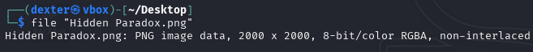
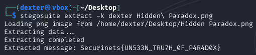

# **CTF Writeup: Hidden Paradox (Image Steganography Challenge)**

## **Challenge Description**

We are given an image file named **`Hidden Paradox.png`**, suggesting that the flag is concealed using steganography. The challenge name hints at a "paradox," possibly indicating a non-obvious hiding method.

## **Solution Walkthrough**

### **Initial Analysis**

First, I verified the file type:

```bash
file "Hidden Paradox.png"
```



Since it was a valid PNG, I suspected **steganography**, possibly requiring a password for extraction.

### **Using StegoSuite for Extraction**

I used **`stegosuite`**, a steganography tool that supports password-protected data extraction. The command used was:

```bash
stegosuite extract -k dexter "Hidden Paradox.png"
```



**Command Breakdown:**

- `extract`: Mode for extracting hidden data.
- `-k dexter`: Specifies the password (`dexter`) needed to unlock the hidden content.
- `"Hidden Paradox.png"`: The input image file.

### **Results**

The tool successfully extracted the hidden message:

```
Loading png image from /home/dexter/Desktop/Hidden Paradox.png
Extracting data...
Extracting completed
Extracted message: Securinets{UN533N_TRU7H_0F_P4R4D0X}
```

### **Retrieving the Flag**

The output directly provided the flag:

```
Securinets{UN533N_TRU7H_0F_P4R4D0X}
```

## **Final Answer**

The flag was extracted using **password-protected steganography**:

**Flag:**

```
Securinets{UN533N_TRU7H_0F_P4R4D0X}
```

## **Key Takeaways**

- **Some steganography tools require a password (`-k` flag) to extract hidden data.**
- **StegoSuite is useful for PNG-based stego challenges with encryption.**
- **Challenge names (e.g., "Paradox") may hint at the method (e.g., password protection).**
- **If initial extraction fails, try common passwords or brute-force approaches.**

This challenge highlights the importance of checking for **password-protected steganography**, a common technique in CTFs and real-world data hiding scenarios.
