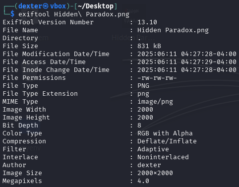

# **CTF Writeup: Hidden Paradox (Metadata & Steganography Challenge)**

## **Challenge Overview**

We were given a PNG image named "Hidden Paradox.png" with dimensions 2000x2000 pixels. The challenge combined **metadata analysis** and **password-protected steganography**.

## **Step-by-Step Solution**

### **1. Initial File Inspection**

First, I verified the file type:

```bash

file "Hidden Paradox.png"

```

Output:

```

Hidden Paradox.png: PNG image data, 2000 x 2000, 8-bit/color RGBA, non-interlaced

```


### **2. Metadata Analysis with ExifTool**

I examined the image metadata for hidden clues:

```bash

exiftool "Hidden Paradox.png"

```

Key findings:

```

Author                          : dexter

```

The **Author** field contained the value "dexter", which turned out to be crucial for solving the challenge.



### **3. Extracting Hidden Data with StegoSuite**

Using the author name as a potential password, I attempted extraction:

```bash

stegosuite extract -k dexter "Hidden Paradox.png"

```

Successful output:

```

Loading png image from /home/dexter/Desktop/Hidden Paradox.png

Extracting data...

Extracting completed

Extracted message: Securinets{UN533N_TRU7H_0F_P4R4D0X}

```


## **Key Techniques Used**

1. **Metadata Inspection**

- Used `exiftool` to discover the password hint in the "Author" field

- Common practice in CTFs to hide clues in metadata

2. **Password-Protected Steganography**

- Recognized the need for a passphrase to extract data

- Used `stegosuite` with the discovered password

3. **Pattern Recognition**

- Connected the "Hidden Paradox" challenge name with the concept of metadata hiding

- Understood that author/creator fields often contain credentials

## **Lessons Learned**

- **Always check metadata first** - Simple tools like `exiftool` can reveal critical clues

- **Think about password sources** - Common locations include:

- Image metadata (author, comment fields)

- File properties

- Challenge descriptions

- **Stego tools vary** - Different tools (`stegosuite`, `steghide`, etc.) may be needed for different challenges

## **Final Flag**

The hidden message was successfully extracted:

```

Securinets{UN533N_TRU7H_0F_P4R4D0X}

```

## **Expansion: Alternative Approaches**

If the initial approach hadn't worked:

1. Try common passwords (admin, password, secret, etc.)

2. Use `strings` command to look for embedded clues

3. Check LSB steganography if password extraction fails

4. Examine the image in a hex editor for unusual patterns

This challenge effectively demonstrated how real-world data might be hidden using multiple layers of concealment.# **CTF Writeup: Hidden Paradox (Image Steganography Challenge)**

## **Challenge Description**

We are given an image file named **`Hidden Paradox.png`**, suggesting that the flag is concealed using steganography. The challenge name hints at a "paradox," possibly indicating a non-obvious hiding method.

## **Solution Walkthrough**

### **Initial Analysis**

First, I verified the file type:

```bash

file "Hidden Paradox.png"

```


Since it was a valid PNG, I suspected **steganography**, possibly requiring a password for extraction.

### **Using StegoSuite for Extraction**

I used **`stegosuite`**, a steganography tool that supports password-protected data extraction. The command used was:

```bash

stegosuite extract -k dexter "Hidden Paradox.png"

```


**Command Breakdown:**

- `extract`: Mode for extracting hidden data.

- `-k dexter`: Specifies the password (`dexter`) needed to unlock the hidden content.

- `"Hidden Paradox.png"`: The input image file.

### **Results**

The tool successfully extracted the hidden message:

```

Loading png image from /home/dexter/Desktop/Hidden Paradox.png

Extracting data...

Extracting completed

Extracted message: Securinets{UN533N_TRU7H_0F_P4R4D0X}

```

### **Retrieving the Flag**

The output directly provided the flag:

```

Securinets{UN533N_TRU7H_0F_P4R4D0X}

```

## **Final Answer**

The flag was extracted using **password-protected steganography**:

**Flag:**

```

Securinets{UN533N_TRU7H_0F_P4R4D0X}

```

## **Key Takeaways**

- **Some steganography tools require a password (`-k` flag) to extract hidden data.**

- **StegoSuite is useful for PNG-based stego challenges with encryption.**

- **Challenge names (e.g., "Paradox") may hint at the method (e.g., password protection).**

- **If initial extraction fails, try common passwords or brute-force approaches.**

This challenge highlights the importance of checking for **password-protected steganography**, a common technique in CTFs and real-world data hiding scenarios.
