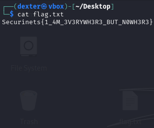
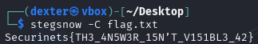

# **CTF Writeup: Invisible Ink (Steganography Challenge with Fake Flag)**

## **Challenge Overview**

The challenge presented a file named `flag.txt` containing what appeared to be a flag, but was actually a decoy. The task required identifying and extracting the real hidden flag using whitespace steganography techniques.

## **Step-by-Step Solution**

### **1. Initial File Inspection**

The `flag.txt` file initially showed:

```bash
cat flag.txt
```

Output:

```
Securinets{1_4M_3V3RYWH3R3_BUT_N0WH3R3}


```



### **2. Identifying the Deception**

Key observations:

- The "flag" was followed by an unusually large amount of whitespace
- Challenge name "Invisible Ink" suggested hidden data in non-visible characters
- The initial flag might be a distraction (fake flag)

### **3. Using Stegsnow for Whitespace Steganography**

I applied the `stegsnow` tool with the `-C` flag (case-insensitive mode):

```bash
stegsnow -C flag.txt
```

Output:

```
Securinets{TH3_4N5W3R_15N'T_V151BL3_42}
```



## **Key Techniques Used**

1. **Whitespace Steganography Detection**

   - Recognized excessive whitespace as potential data carrier
   - Understood that spaces and tabs can encode hidden information

2. **Tool Selection**

   - Used `stegsnow`, specifically designed for whitespace steganography
   - `-C` flag for case-insensitive extraction

3. **Fake Flag Identification**
   - Noticed the suspicious formatting of the file
   - Recognized common CTF tactics using decoy flags

## **Technical Explanation**

Stegsnow works by:

- Using the whitespace after the end-of-line (EOL) markers
- Encoding data in the pattern of spaces and tabs
- Supporting encryption with passwords (though not needed here)

## **Lessons Learned**

1. **Never trust surface-level content** - Always verify flags, especially those easily visible
2. **Whitespace matters** - Excessive spaces/tabs often indicate hidden data
3. **Know your stego tools**:
   - `stegsnow` for whitespace steganography
   - `steghide` for image steganography
   - `binwalk` for file carving
4. **Challenge names are clues** - "Invisible Ink" clearly pointed to hidden writing techniques

## **Final Flag**

The real hidden flag was:

```
Securinets{TH3_4N5W3R_15N'T_V151BL3_42}
```

## **Prevention Measures**

For system administrators:

- Monitor files with unusual whitespace patterns
- Implement whitespace normalization in text processing systems
- Use tools like `stegdetect` to identify potential steganography

This challenge effectively demonstrated how attackers might hide data in plain sight using seemingly innocuous text files.
