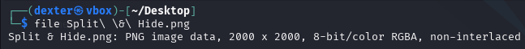
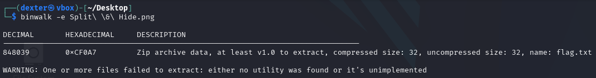
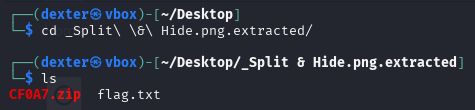
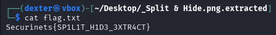

# **CTF Writeup: Split & Hide (File Carving Challenge)**

## **Challenge Overview**

The challenge presented an image file named "Split & Hide.png" that contained hidden data. The task required extracting embedded files to uncover the flag.

## **Step-by-Step Solution**

### **1. Initial File Inspection**

First, I verified the file type:

```bash
file "Split & Hide.png"
```

This confirmed it was a valid PNG image file.



### **2. File Carving with Binwalk**

I used `binwalk` to analyze and extract embedded files:

```bash
binwalk -e "Split & Hide.png"
```

**Output Analysis:**

```
DECIMAL       HEXADECIMAL     DESCRIPTION
--------------------------------------------------------------------------------
848039        0xCF0A7         Zip archive data, at least v1.0 to extract
```

- Detected a ZIP archive embedded at offset 848039 (0xCF0A7)
- Warning indicated some extraction limitations but the process was successful



### **3. Examining Extracted Files**

The extraction created a new directory:

```bash
cd _Split\ \&\ Hide.png.extracted/
ls
```

Found two files:

- `CF0A7.zip` (the extracted archive)
- `flag.txt` (containing our flag)



### **4. Retrieving the Flag**

The flag was directly available in the extracted text file:

```bash
cat flag.txt
```

Output:

```
Securinets{SP1L1T_H1D3_3XTR4CT}
```



## **Key Techniques Used**

1. **File Carving**

   - Used `binwalk` to identify and extract embedded files
   - Recognized common file signatures (ZIP in this case)

2. **Embedded Archive Handling**

   - Understood that the warning didn't prevent successful extraction
   - Verified extracted contents despite the warning message

3. **Challenge Name Interpretation**
   - "Split & Hide" suggested divided/embedded content
   - Recognized this as a file carving challenge

## **Technical Explanation**

- The PNG file had a ZIP archive appended to its end
- `binwalk` detected the file signature (PK header for ZIP files)
- Extraction revealed both the archive and its contents

## **Lessons Learned**

1. **Always check for embedded files** - Even images can contain hidden archives
2. **Understand tool warnings** - Some warnings don't indicate failure
3. **Multiple extraction methods** - Alternative tools include:
   - `foremost`
   - `dd` with manual offset extraction
   - `7z` for password-protected archives

## **Final Flag**

The extracted flag was:

```
Securinets{SP1L1T_H1D3_3XTR4CT}
```

## **Prevention Measures**

For secure systems:

- Validate file contents before upload/processing
- Use file sanitization tools
- Monitor for files with embedded data
- Implement file type verification

This challenge demonstrated how attackers can hide data within seemingly innocent files, a common technique in both CTFs and real-world attacks.
