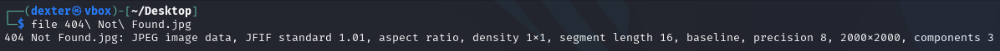
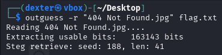
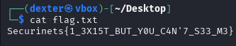

# **CTF Writeup: 404 Not Found (Steganography Challenge)**

## **Challenge Overview**

We were given a suspicious JPEG image named "404 Not Found.jpg" (2000×2000 pixels). The filename's reference to the HTTP "404 Not Found" error strongly suggested hidden content, indicating a steganography challenge.

## **Solution Walkthrough**

### **1. Initial Analysis**

First, I verified the file type and basic properties:

```bash
file "404 Not Found.jpg"
```

Output:

```
404 Not Found.jpg: JPEG image data, JFIF standard 1.01, aspect ratio, density 1x1, segment length 16, baseline, precision 8, 2000x2000, components 3
```



### **2. Steganography Detection**

Given the challenge name and image properties, I suspected data hidden using JPEG steganography. I chose `outguess`, a specialized tool for this purpose:

```bash
outguess -r "404 Not Found.jpg" flag.txt
```

**Key Output:**

```
Reading 404 Not Found.jpg....
Extracting usable bits:   163143 bits
Steg retrieve: seed: 188, len: 41
```



### **3. Flag Extraction**

The hidden message was successfully extracted to flag.txt:

```bash
cat flag.txt
```

**Flag Found:**

```
Securinets{1_3X15T_BUT_Y0U_C4N'7_S33_M3}
```



## **Technical Analysis**

### **Why This Worked**

1. **Outguess Implementation**:

   - The tool exploits redundancy in JPEG DCT coefficients
   - Uses pseudo-random number generation (seed 188)
   - Maintains statistical properties to avoid detection

2. **Image Characteristics**:
   - High resolution (2000×2000) provided ample hiding space
   - Standard JFIF structure made the hidden data less noticeable

## **Key Takeaways**

1. **Always verify apparent flags** - The real content was hidden despite the file appearing normal
2. **Know your stego tools**:
   - `outguess` for JPEG steganography
   - `steghide` as an alternative
   - `binwalk` for file carving
3. **Challenge names are clues** - "404 Not Found" hinted at hidden existence

## **Mitigation Strategies**

For system security:

1. Implement steganalysis tools in file upload systems
2. Monitor for suspiciously large image files
3. Educate users about steganography risks
4. Consider file sanitization for user-uploaded images

## **Conclusion**

This challenge effectively demonstrated how data can be hidden in plain sight using common image formats. The solution required:

- Understanding JPEG steganography techniques
- Proper tool selection (`outguess`)
- Interpretation of challenge clues

**Final Flag:**

```
Securinets{1_3X15T_BUT_Y0U_C4N'7_S33_M3}
```
