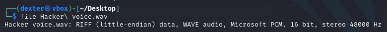
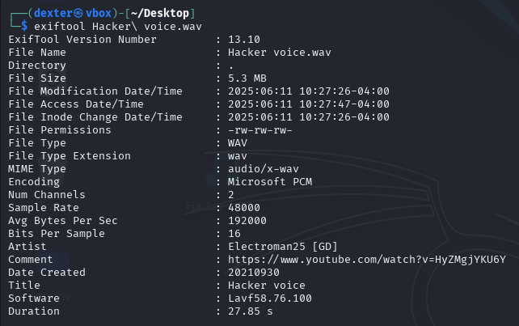
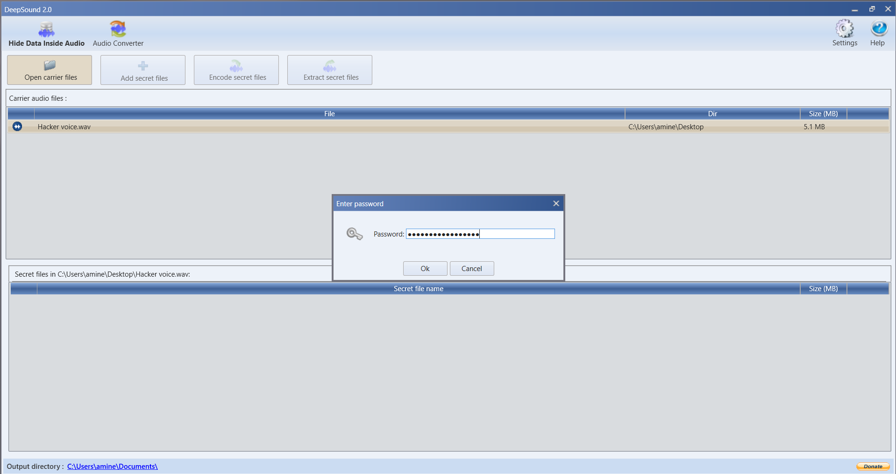
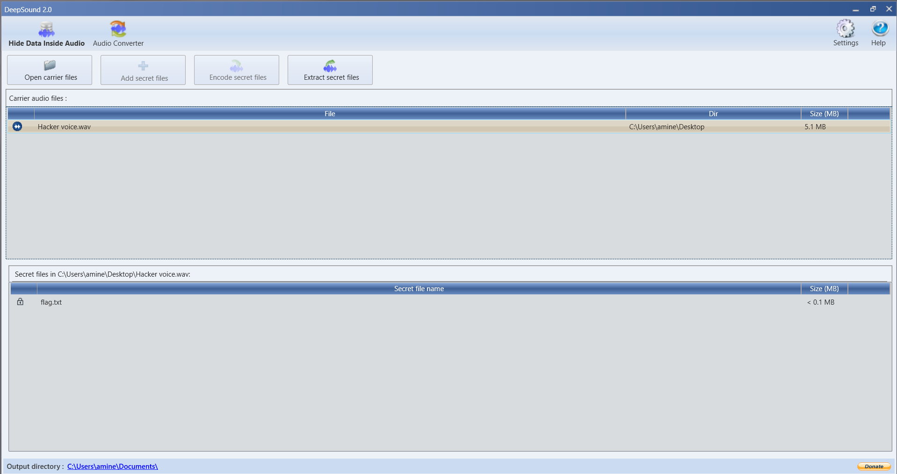
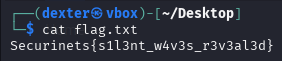

# **CTF Writeup: Invisible Crescendo (Audio Steganography Challenge)**

## **Challenge Overview**

We were provided with a WAV audio file named "Hacker voice.wav". The challenge name "Invisible Crescendo" suggested hidden data within the audio file, likely protected by a password found in the metadata.

## **Solution Walkthrough**

### **1. Initial File Analysis**

First, I verified the file type and basic properties:

```bash
file "Hacker voice.wav"
```

Output:

```
Hacker voice.wav: RIFF (little-endian) data, WAVE audio, Microsoft PCM, 16 bit, stereo 48000 Hz
```



### **2. Metadata Examination**

I extracted the metadata using `exiftool`:

```bash
exiftool "Hacker voice.wav"
```

Key findings:

```
Artist: Electroman25 [GD]
Comment: https://www.youtube.com/watch?v=HyZMgjYKU6Y
Title: Hacker voice
```



### **3. Password Extraction**

The challenge hint mentioned using the password from metadata. The most likely candidate was the Artist field:

```
Password: Electroman25 [GD]
```

### **4. Audio Steganography Extraction**

Using `deep sound` with the discovered password:

1. Opened the WAV file in DeepSound
2. Selected "Extract secret files" option
3. Entered password: `Electroman25 [GD]`
4. Extracted hidden file `flag.txt`





### **5. Flag Retrieval**

The extracted file contained:

```
cat flag.txt
```

**Flag Found:**

```
Securinets{s1l3nt_w4v3s_r3v3al3d}
```



## **Technical Analysis**

### **Why This Worked**

1. **Audio Steganography**:

   - DeepSound hides data in audio files using LSB techniques
   - Password protection adds an extra layer of security
   - Maintains audio quality while hiding data

2. **Metadata Importance**:
   - Artist field often contains credentials in CTF challenges
   - Other fields (Comment, Title) can provide additional hints

## **Key Takeaways**

1. **Always check metadata first** - Simple tools like `exiftool` can reveal crucial clues
2. **Audio steganography tools**:
   - DeepSound for password-protected audio stego
   - Sonic Visualizer for spectrogram analysis
   - Audacity for manual inspection
3. **Challenge names are clues** - "Invisible Crescendo" hinted at hidden audio data

## **Mitigation Strategies**

For system security:

1. Sanitize metadata in uploaded audio files
2. Monitor for unusually large audio files
3. Implement steganalysis tools in security pipelines
4. Educate users about steganography risks

## **Conclusion**

This challenge demonstrated how data can be hidden in audio files using specialized tools and protected with metadata-derived passwords.

**Final Flag:**

```
Securinets{s1l3nt_w4v3s_r3v3al3d}
```

## **Alternative Approaches**

If DeepSound didn't work:

1. Try `steghide` with the same password
2. Examine spectrogram for visual patterns
3. Check for LSB steganography using specialized tools
4. Analyze file with hex editor for unusual patterns
