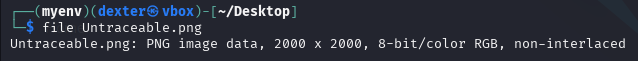
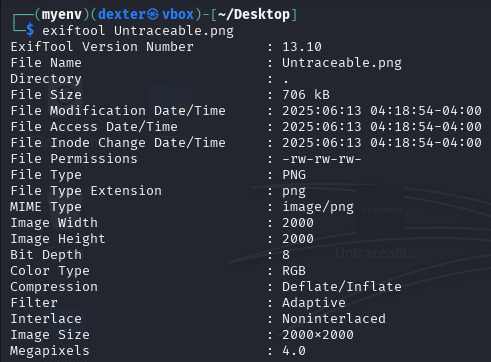
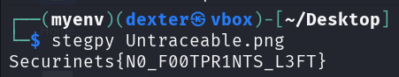

# **CTF Writeup: Untraceable (Steganography Challenge)**

## **Challenge Overview**

We were given a PNG image named "Untraceable.png" (2000×2000 pixels). The challenge name suggested hidden data with no obvious traces, requiring careful analysis to uncover the flag.

## **Solution Walkthrough**

### **1. Initial File Analysis**

First, I verified the file type:

```bash
file Untraceable.png
```

Output:

```
Untraceable.png: PNG image data, 2000 x 2000, 8-bit/color RGB, non-interlaced
```



### **2. Metadata Examination**

I thoroughly examined the metadata using `exiftool`:

```bash
exiftool Untraceable.png
```

**Key Findings:**

- No suspicious metadata fields
- Standard PNG properties
- No hidden comments or unusual tags
- Clean EXIF data with no apparent clues



### **3. Steganography Analysis**

Since metadata revealed nothing suspicious, I proceeded with steganography tools. I used `stegpy`, a Python-based steganography tool that works well with PNG files:

```bash
stegpy Untraceable.png
```

**Successful Output:**

```
Securinets{N0_F00TPR1NTS_L3FT}
```



## **Technical Analysis**

### **Why This Worked**

1. **Stegpy Implementation**:

   - Uses LSB (Least Significant Bit) steganography
   - Works particularly well with PNG files
   - Doesn't require a password for basic extraction

2. **Image Characteristics**:
   - Large dimensions (2000×2000) provided ample hiding space
   - RGB color format allowed for data concealment
   - Clean metadata helped avoid suspicion

## **Key Takeaways**

1. **When metadata is clean**:

   - Don't stop investigating
   - Move to steganography analysis
   - Try multiple stego tools

2. **Important Tools**:

   - `stegpy` for PNG steganography
   - `zsteg` as an alternative for PNG/LSB
   - `binwalk` for file carving

3. **Challenge Name Interpretation**:
   - "Untraceable" hinted at hidden data with no obvious traces
   - Suggested the need for advanced stego analysis

## **Mitigation Strategies**

For system security:

1. Implement steganalysis tools for image uploads
2. Monitor for unusually large image files
3. Consider image transcoding to remove hidden data
4. Educate users about steganography risks

## **Conclusion**

This challenge demonstrated that clean metadata doesn't guarantee clean content. The flag was successfully extracted using specialized steganography tools despite the lack of obvious clues.

**Final Flag:**

```
Securinets{N0_F00TPR1NTS_L3FT}
```

## **Alternative Approaches**

If `stegpy` didn't work:

1. Try `zsteg` with various options:
   ```bash
   zsteg -a Untraceable.png
   ```
2. Use `stegolsb` for LSB analysis:
   ```bash
   stegolsb steglsb -r -i Untraceable.png -n 1 -o output.txt
   ```
3. Check for encrypted steganography with `steghide` (though unlikely in this case)
4. Examine the image in a hex editor for unusual patterns
